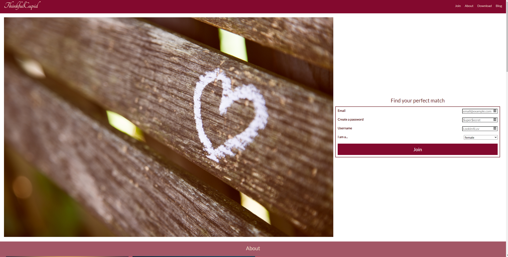
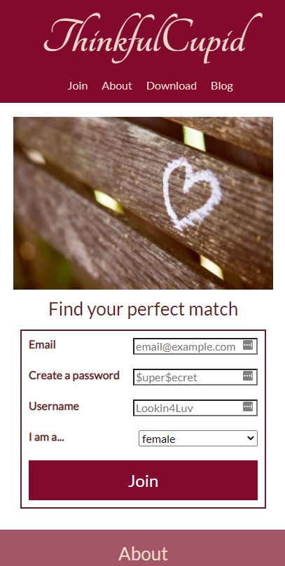
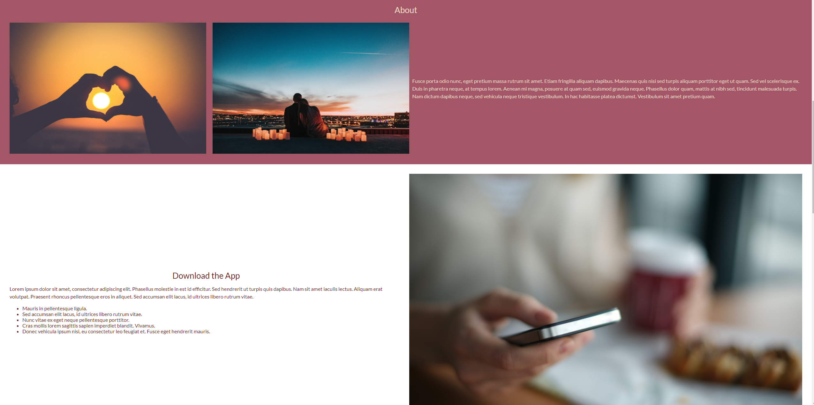
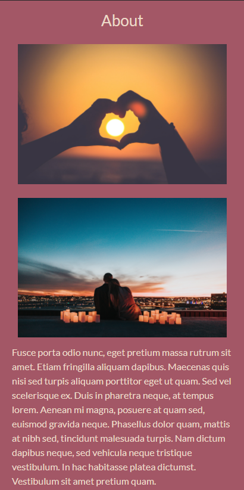
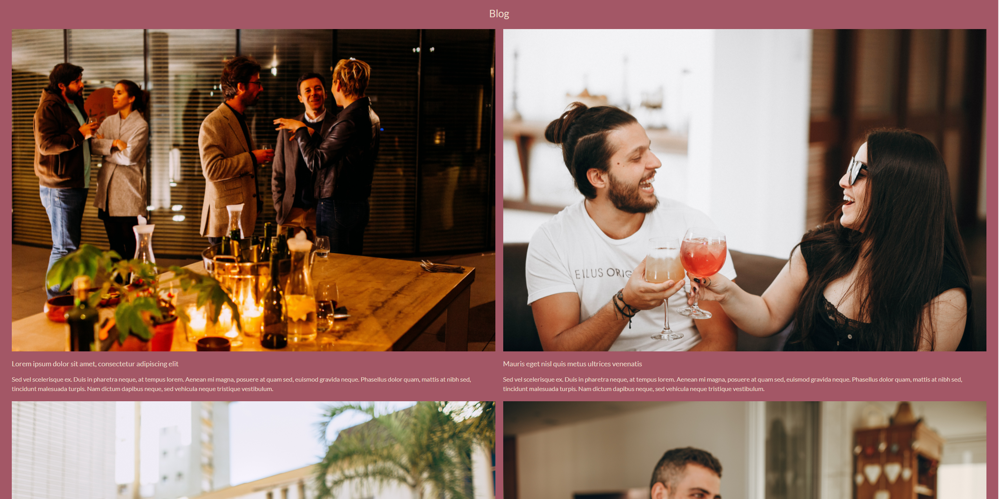
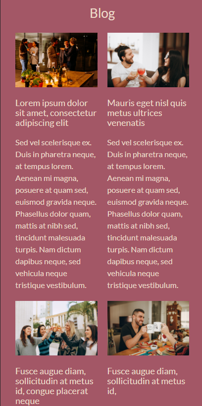

# About ThinkfulCupid

This project was created as part of the Thinkful curriculum's front end foundations module.
Images and styling were provided and the students were responsible for implementing a mobile first design.

## Project Goals

Use knowledge of mobile first design, media queries, and CSS flexbox to implement a responsive, mobile first version of the given webpage.

## Technology and Tools

- CSS
- HTML

## Project Preview

